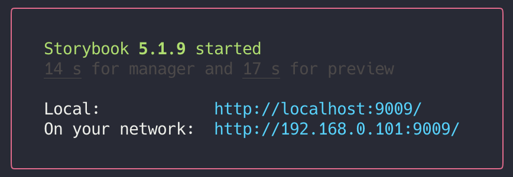

# ZABO Front

ZABO helps **KAIST students based** individuals or clubs advertising themselves via web based platform not only in an analogue way. While this service is open public, **only KAIST members** are allowed to post images on this website and others must manually get permission from SPARCS KAIST's current project manager.

We're expecting anyone satisfying above conditions posting there recruiting announcements, performance schedules, and any other events in much better condition (posting paper posters at each dorms, cafeterias, E11, ...etc) with ease and joy.

Please contact SPARCS KAIST to get more detailed information.

If you're looking for backend codes, you can find it in [here](https://github.com/sparcs-kaist/zabo-server-nodejs)

## Table of Contents

- [Prerequisites](#prerequisites)
- [Getting Started](#getting-started)
    - [Running Development Server](#running-development-server)
        - [Using npm](#npm)
        - [Using yarn](#yarn)
    - [Available Scripts](#available-scripts)
        - [Storybook](#storybook)
        - [Generate Component](#generate-component)
        - [Post Build](#post-build)
        - [Pre-Commit](#pre-commit)
    - [Get Ready for Production](#get-ready-for-production)
        - [Using npm](#npm)
        - [Using yarn](#yarn)
- [Redirect API Requests](#redirect-api-requests)
- [Built With](#built-with)
- [Folder Structure](#folder-structure)
- [Deployment](#deployment)
- [Commit Message Guidelines](#commit-message-guidlines)
    - [Commit Message Format](#commit-message-format)
    - [Revert](#revert)
    - [Type](#type)
    - [Scope](#scope)
    - [Subject](#subject)
    - [Body](#body)
    - [Footer](#footer)
- [Branch Management](#branch-management)
- [Versioning](#versioning)
- [Authors](#authors)
- [Contributing](#contributing)
- [License](#license)
- [Acknowledgements](#acknowledgements)

## Prerequisites

**You’ll need to have Node 8.10.0 or local development and production machine**. You can use [nvm](https://github.com/creationix/nvm#installation) (macOS/Linux) or [nvm-windows](https://github.com/coreybutler/nvm-windows#node-version-manager-nvm-for-windows) to easily switch Node versions between different projects.
Node.js. That's all you need.

```sh
node -v // v10.16.3
```

## Getting Started

### Running Development Server

#### npm

Run webpack dev server

```sh
npm install // Installing dependencied with node js package manager
npm start // Refer to react-scripts(https://www.npmjs.com/package/react-scripts) to learn more about this.
// Follow the instructions on terminal
```

#### yarn

Run server

```sh
yarn // Installing dependencied with node js package manager
yarn start // Refer to react-scripts(https://www.npmjs.com/package/react-scripts) to learn more about this.
// Follow the instructions on terminal
```

### Available Scripts

#### Storybook

```sh
yarn storybook
```




#### Generate Component
```sh
yarn generate [% component_architecture %] [% component_name %] "[% options %]"
```
* component_architecture :  One of [atoms, molecules, organisms, templates, pages]
* component_name : Captitalized first character is recommended (ex: HomePage)
* options (optional) : Combination of characters (r : react component, s : styled component, y : storybook, c : redux container) or '*' for all.
	Options must be captured inside quotes (" or ').
	Default option is "rsy"

#### Post Build

```sh
yarn postbuild
```

Copy build folder to deploy folder to remove down time caused by rimraf in build process (yarn build)

Automatically triggered after build command finishes.

#### Pre-Commit

```sh
yarn precommit
```

Lint and rewrite staged files.

Automatically triggered before commit.

### Get Ready for Production

#### npm

Build static files with webpack

```sh
npm install // Installing dependencied with node js package manager
npm run build  // Refer to react-scripts(https://www.npmjs.com/package/react-scripts) to learn more about this.
server -s deploy // or serve static files located in /deploy with whatever you like!
// I recommend you to set up production server with nginx. Please refer to [Deployment](#deployment) section for more.
```

#### yarn

Build static files with webpack

```sh
yarn // Installing dependencied with node js package manager
yarn build  // Refer to react-scripts(https://www.npmjs.com/package/react-scripts) to learn more about this.
server -s deploy // or serve static files located in /deploy with whatever you like!
// I recommend you to set up production server with nginx. Please refer to [Deployment](#deployment) section for more.
```

## Redirect API Requests

All requests sent from client are intercepted by an axios instance located in [axios.js](src/lib/axios.js).

You can change **baseURL** option to redirect all requests to specific domain or IP.

## Built with

* [Atomic Web Design](http://bradfrost.com/blog/post/atomic-web-design/)
* [Create React App](https://create-react-app.dev/) - Easy set up for react project
* [Redux](https://redux.js.org/) - In-memory data structure store.

## Folder Structure
```
zabo-front
├── README.md
├── LICENSE.md
├── deploy
├── public
├── node_modules
├── package.json
├── .gitignore
├── tools
│   ├── generate-component.py
│   └── moveBuildFolder.sh
├── src
│   ├── index.js - Entry point
│   ├── App.js
│   ├── boot.js - Ran before rendering app
│   │
│   ├── components - All React Components
│   │   ├── container
│   │   ├── atoms
│   │   ├── molecules
│   │   ├── organisms
│   │   ├── templates
│   │   └── pages - Please refer to atomic web design (http://bradfrost.com/blog/post/atomic-web-design/)
│   │
│   ├── lib - Libraries and utility functions
│   ├── hoc - Higher order components (https://reactjs.org/docs/higher-order-components.html)
│   ├── locales - Translation files /en, /kr
│   ├── static - Static files such as images
│   └── store - Redux files
└── index.js  - Entry point
```

## Deployment

First, build static files with webpack regarding to [Get Ready for Production](#get-ready-for-production)
And then follow [zabo-server-nodejs deployment guide-line](https://github.com/sparcs-kaist/zabo-server-nodejs/tree/develop#running-production-server)

## Commit Message Guidelines

I referred [Google's Angular JS's contributor's commit message guidelines](https://github.com/angular/angular/blob/master/CONTRIBUTING.md#-commit-message-guidelines) to format commit messages. This leads to more **unified** and **readable messages** helping further history lookups and even CI integrations.

By the way, this repository's commit messages format is not exactly same as the one suggested above.

### Commit Message Format

Each commit message consists of a **header**, a **body** and a **footer**.  The header has a special
format that includes a **type**, a **scope** and a **subject**:

```
<type>(<scope>): <subject>
<BLANK LINE>
<body>
<BLANK LINE>
<footer>
```

The **header** is mandatory and the **scope** of the header is optional.

Any line of the commit message cannot be longer 100 characters! This allows the message to be easier
to read on GitHub as well as in various git tools.

Samples: (even more [samples](https://github.com/sparcs-kaist/zabo-server-nodejs/commits/master))

```
docs(README): update README adding instruction on how to start docker on EC2
```
```
build(babel): Add babel preset-env

Add @babel/core, @babel/preset-env and register with @babel/register.
Entry point of the application is set to be bin/www_es6.js
Refer to the package.json file to fidn out more.
```

### Revert
If the commit reverts a previous commit, it should begin with `revert: `, followed by the header of the reverted commit. In the body it should say: `This reverts commit <hash>.`, where the hash is the SHA of the commit being reverted.

### Type
Should be one of the following:

* **build**: Changes that affect the build system or external dependencies (example scopes: gulp, broccoli, npm)
* **ci**: Changes to our CI configuration files and scripts (example scopes: Circle, BrowserStack, SauceLabs)
* **docs**: Documentation only changes
* **feat**: A new feature
* **fix**: A bug fix
* **perf**: A code change that improves performance
* **refactor**: A code change that neither fixes a bug nor adds a feature
* **style**: Changes that do not affect the meaning of the code (white-space, formatting, missing semi-colons, etc)
* **test**: Adding missing tests or correcting existing tests
* **misc**: Adding miscellaneous items

### Scope
There's no specific recommendations for naming scope yet.
Feel free to write your own scopes.

### Subject
The subject contains a succinct description of the change:

* use the **imperative, present tense**: "change" not "changed" nor "changes"
* **do capitalize** the first letter
* no dot (.) at the end

### Body
Just as in the **subject**, use the imperative, present tense: "change" not "changed" nor "changes".
If the commit derives changes from previous behavior, the body should include the motivation for the change and contrast this with previous behavior.

### Footer
The footer should contain any information about **Breaking Changes** and is also the place to


## Branch Management

I use [git-flow](https://danielkummer.github.io/git-flow-cheatsheet/index.html) to manage branches. For branch history, see the [branches on this repository](https://github.com/sparcs-kaist/zabo-front-reactjs/branches).


## Contributing

Member of SPARCS-KAIST can freely contribute on this repository.

## Versioning

I use [SemVer](http://semver.org/) for versioning. For the versions available, see the [tags on this repository](https://github.com/sparcs-kaist/zabo-front-reactjs/tags).
## Authors

* **Cookie** - [Cookie](https://github.com/jungdj)
* **Hubo** - [bhanghj3094](https://github.com/bhanghj3094)
* **Hou** - [Sanghou](https://github.com/Sanghou)
* **Parang** - [pa-rang](https://github.com/pa-rang)
* **Paco** - [pacokwon](https://github.com/pacokwon)
* **Sniperj** - [sni-j](https://github.com/sni-J)


## License

This project is licensed under the MIT License - see the [LICENSE.md](LICENSE.md) file for details

## Acknowledgments

We're renewing following projects.

[Zabo-WEB](https://github.com/sparcs-kaist/zabo-web) and [Zabo-API](https://github.com/sparcs-kaist/zabo-api)
